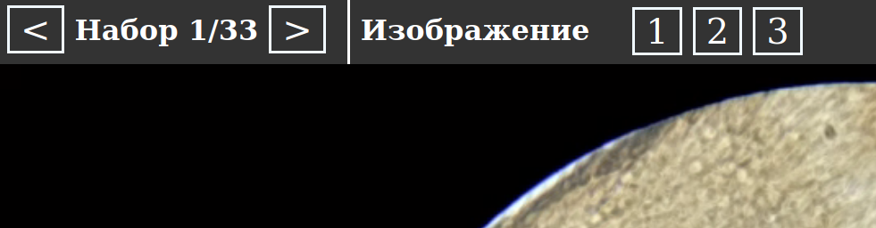
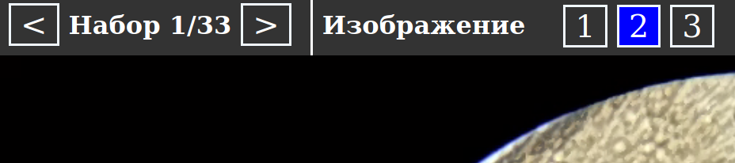
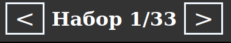

## Спасибо, что принимаете участие в нашем опросе!

Наше исследование посвящено использованию смартфонов в мобильной микроскопии. Основная задача исследования -- получить качественные изображения, снятые на микроскоп, с использованием камеры смартфона.

  
  
  

### Важные моменты

* Мы были бы очень признательны, если Вы пройдете опрос с **мобильного телефона**. Если у Вас есть возможность пройти опрос только с компьютера, мы всё равно будем рады обратной связи.
* В ходе опроса необходимо выбрать наиболее понравившиеся кадры из N наборов изображений. Для переключения используйте клавиши "1", "2", "3" и т.д. на панели.

  

* Чтобы лучше рассмотреть детали изображения его можно двигать, увеличивать и уменьшать. При переходе к другому изображению из набора увеличение и сдвиг сохраняются.

  

  
* Для Вашего удобства при прохождении опроса с компьютера реализована возможность использовать горячие клавиши, подробную подсказку вы найдете в верхнем правом углу при начале опроса.

  

* Выбранный кадр помечается синим цветом автоматически. **Внимание:** при переключении к следующему набору в качестве  ответа сохраняется последний просматриваемый кадр, т.е. тот, чей номер помечен синим цветом.

  

* Для переключения между наборами используйте кнопки "<" и ">". Вы можете возвращаться к ранее просмотренным образцам, выбор будет сохранен.

  

* В конце опроса нажмите на кнопку "Отправить результаты". Чтобы начать опрос, перейдите по [ссылке](https://kutuevvladimir.github.io/survey.html).
* По всем вопросам, обращайтесь на почту: <vladimir.kutuev@gmail.com>
